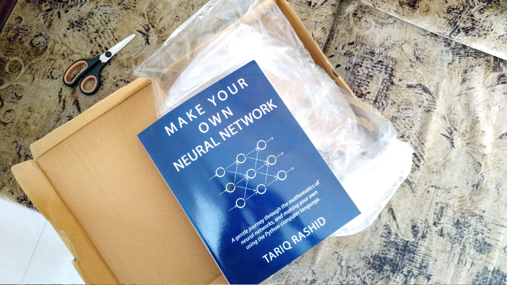

Title: Getting started with Neural Networks using bottom-up approach
Date: 2017-03-10 9:32
Slug: ann-getting-started
Tags: book, reference, getting-started, ai, artificial-intelligence, neural-networks, ann
Authors: Rihan Pereira
Summary: One of many alternative ways you can get started with studying Neural Nets

Yes! __Make Your Own Neural Network__ can be good starting point for beginners like me. Just few years back, my
college offered only Artificial Intelligence as an elective in my undergraduate curriculum. The course covered 
general definitions and terminologies on the subject but it failed to mention its child subjects like machine learning, neural networks, data science, etc, only when I watched Professor Andrew Ng's lecture on youtube, things started appealing.
Then I found this book after making a search on Amazon. I bet you, if you want to just dig in right away to really
see for yourself whether Neural Networks amazes you, then this might be the book you want to read.

Neural Nets requires you to know __Calculus__. You need to know __Differentiation__. The Calculus you studied in high
school and in the 1st two year's of undergraduate degree and more on as you cruise through it. Isn't it amazing to actually apply it through source code? 
This book shows you how you put it to practice. As of now, I am just finished with first 50 pages and I can say I
have learned the material so far . The mathematics is refreshing. In fact, this book has, for the very first time,
convinced me how great Calculus is as a tool. I just need to practice and make repetitions.

