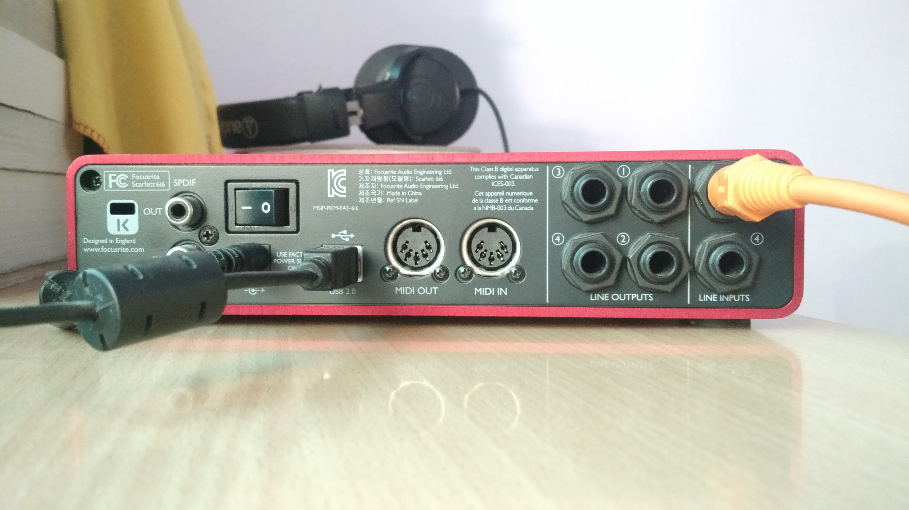
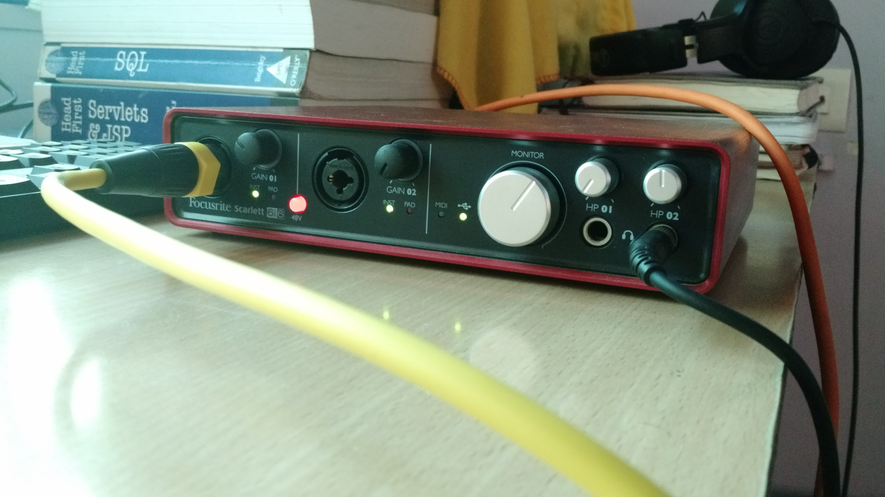

Title: Focusrite Scarlett 6i6 USB audio interface
Date: 2016-06-07 17:00
Slug: usb-audio-interface
Tags: audio processing, soundcard, midi, recording
Authors: Rihan Pereira
Summary: The Focusrite 6 I/O channel audio interface that I bought for recording instruments

Audio Interface is a useful device for connecting, consolidating multiple musical instruments and route them
all to audio recording software, also called as Digital Audio WorkStation(DAW).

I got this 6 I/O channel 1st generation audio interface for the very same purpose it is used for. If you are
wondering how this device is giving you 6 I/O then here is how it goes.

6 Channel Inputs:
-----------------
* 2 Combo XLR preamps at the front panel
* 2 Line inputs at the back panel
* 1 MIDI input(read midi information from some device), back panel
* 1 SPDIF IN (uses single RCA connector to read in audio from CD player which has SPDIF output), back panel

6 Channel Outputs:
-------------------
* 4 Line Outputs at the back panel
* 1 MIDI output(send midi information from computer to MIDI enabled device), back panel
* 1 SPDIF output(uses single RCA connector to send in unbalanced audio signal to CD player which has SPDIF IN)

Quickly, I would like to explore its front & back panels.

Back Panel:
------------
-------------

- __Line Inputs:__ These are balanced jacks, can connect 7.5mm unbalanced jacks as well.
- __Line Outputs:__ The line outputs numbered 1 to 4 also provide balanced signal . So far, I have used line
outputs 1 & 2 to connect to one of my friend's FX processor and have not got a chance to use outputs 3 and 4.
- __USB Port:__ connect the interface to your computer. In other words, record to USB out.
- __MIDI In & MIDI out:__ - Haven't used these as I dont have a MIDI-enabled device. Maybe in the future I would 
have one. 
- __SPDIF IN & OUT:__ RCA socket required to read in/ write out audio signals from the scarlett to Home theatre's
which usually has SPDIF sockets.

Front Panel:
-------------
------------

- __XLR Combo inputs:__ allows you to connect mics, guitars with male XLR jacks or 7.5mm balanced or unbalanced cables.
- __Gain control knobs:__ Both pre-amps have individual gain control. They are equipped with illuminating LEDs in
"circle" shape, used as gain level monitor. They remain green for normal signal and red in case of high or unexpected noisy signal.
- __Monitor knob:__ functions as main monitor output level controller adjusting outputs 1st and 2nd at the back
panel.
- __HP 01 & HP 02:__ allows you to connect stereo headphones to two TRS sockets. These headphones, to my
understanding, get the same signal routed to outputs at the back panel.
