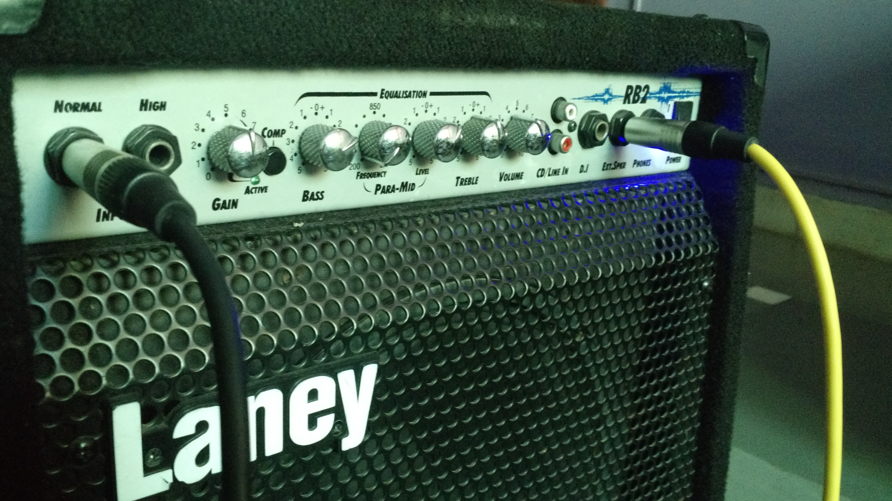
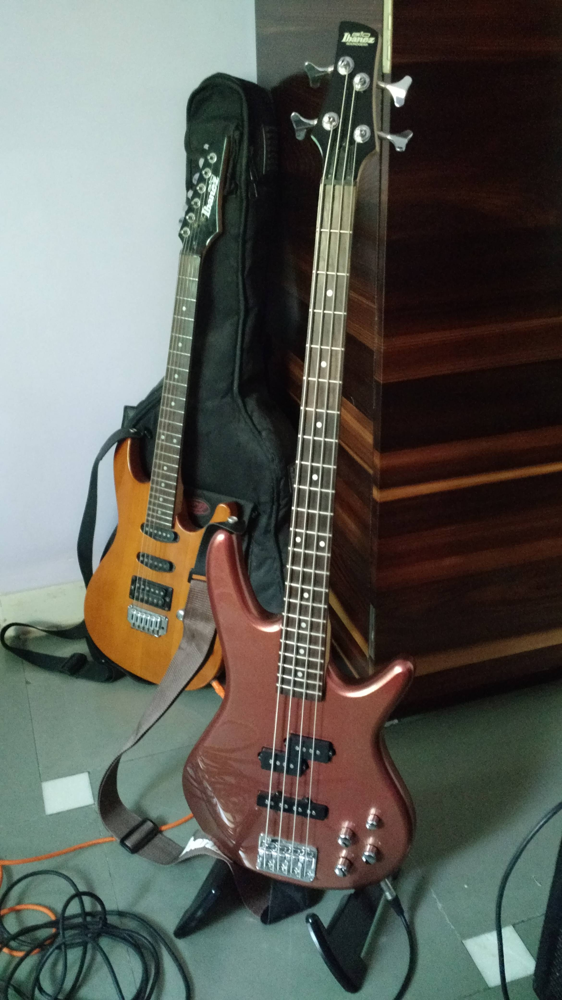

Title: Ibanez GSR-200 with Laney RB2 Bass Amp
Date: 2015-12-09 16:21
Slug: guitar-gear
Tags: music, bass instrument, laney, amplifier, amateur, ibanez
Authors: Rihan Pereira
Summary: A review about the gear I bought to play along with my cousins, friends and the community people around

# The RB2 Bass Amp
This 30 Watts bass guitar Amplifier is very portable, handy to carry along with your instrument. For me it was worth purchasing as I used and still using it for practicing and rehearsing with my fellow band mates before playing live. However, I didnt use it as a monitor at live Gigs because it wasn't required many times as the sound guy already had monitors arranged on stage. This Amp is known for its connection options it provides out-of-box like the Equilizer, DI, and the Auxillary IN socket.

###### Front Panel Controls
* __Normal & High Inputs:__  To connect the other end of your guitar jack into one of the normal or high sockets.
"High" input is given to connect high output bassses but you can connect high output to normal input socket.
* __Gain:__ To adjust the amount of gain you want into the pre-amp. You will notice that the more to turn the knob
to a higher degree, the signal produces distortion. Therefore, its wise to adjust it along with the combination of
volume control to achieve desired characteristics.
* __Compression Push Down Button:__ Alters the input signal by giving out compact signal which is unnoticeable for
most people including me :). This Amp glows the light when their is a sudden spike in the signal, the very time when
you play a loud note. I noticed it when my gain control was set at 7 and the light turned green when note were 
plucked louder than the normal.
* __Bass:__ Very clear. Regulates bassy sound by masking out low-frequency in the signal
* __Para-Mids:__ Cancel or enhance mid frequencies.
* __Treble:__ Controls the bass(high frequency) signal. Not used so far. I am not sure but the knob malfunctions 
and produces humming sound, so its always zero.
* __CD/Line In:__ Its a Aux IN. Plays records from external music player. Very useful for playing to backing tracks
* __Direct Input(D.I):__ If connected, takes the balanced signal from the pre-amplifier to PA system or FX mixer
console

# Ibanez GSR 200 Bass Guitar:

After consulting few bass players on the music forums, I settled for this infamous entry-level bass. So far, this
guitar has played nicely during live gigs. I am using everything factory included. I had to adjust its truss rod
and replaced its strings to light gauge.

Here is a one of the video songs from our concert:

<iframe width="800" height="500" src="https://www.youtube.com/embed/Jz5gt6mWXbs" frameborder="0"></iframe>

