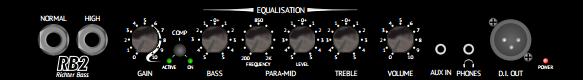
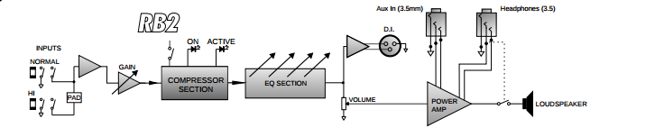

Title: Ibanez GSR-200 with Laney RB2 Bass Amp
Date: 2015-12-09 16:21
Slug: guitar-gear
Tags: music, bass instrument, laney, amplifier, amateur, ibanez
Authors: Rihan Pereira
Summary: A review about the gear I bought to play along with my cousins, friends and the community people around

Talk about your bass guitar. Its style. Express the thing in adjectives. Let them hear what you say.

Laney RB2 Bass Amp:
---------------------

Front Panel Controls:
-----------------------

Laney RB2 Block Diagram:
---------------------------

Ibanez GSR 200
--------------------

