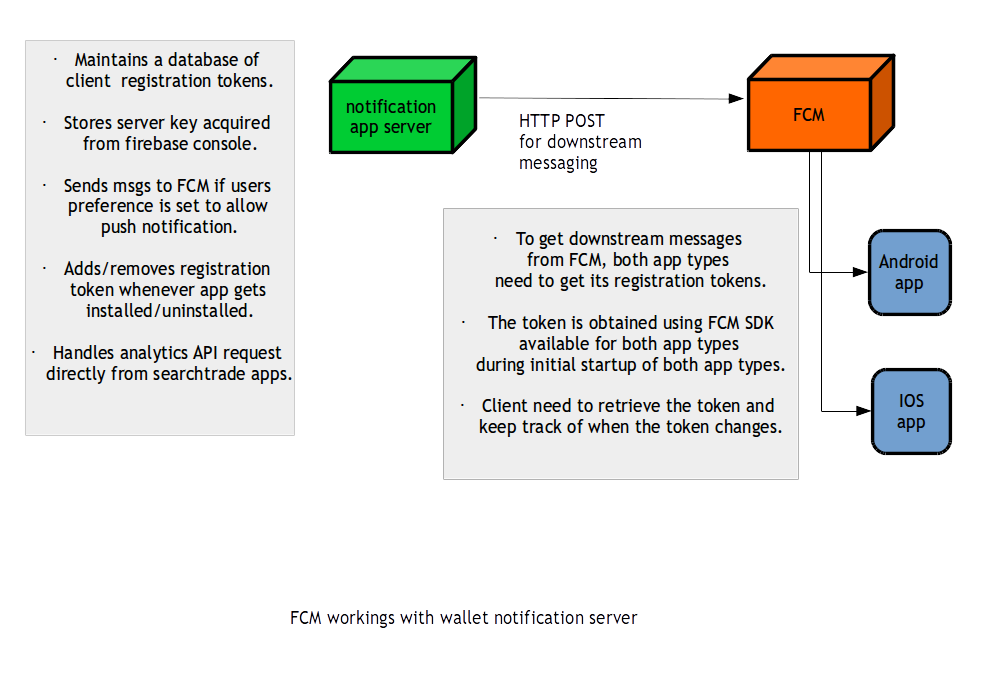

Title: Multi-device Push Messaging using FCM
Date: 2016-09-13 23:18
Slug: multi-device-fcm
Summary: Utilizing Firebase Push Messaging Technology to logically forward messages to users on multiple logged-in devices.

The above illustration details how I managed to setup push notifications backend on that
green box.

 
