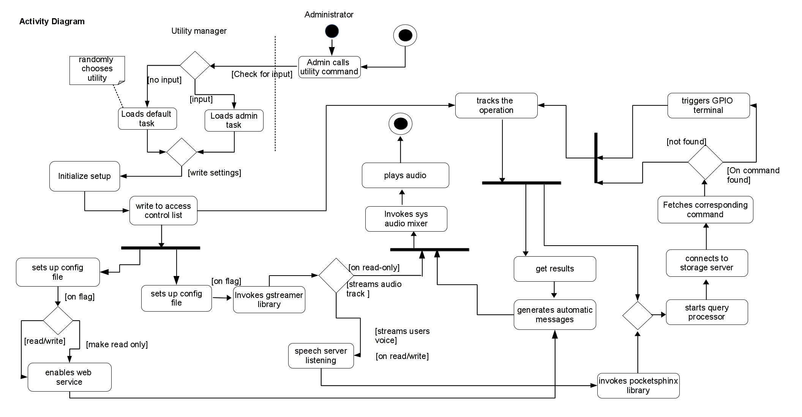

Title: Electrical Appliance Control(EAS) using Raspberry Pi, Arduino and Relay
Date: 2013-11-21 21:41
Slug: eas-pi
Summary: Using a administrative web control panel allows authenticated user to control, monitor and regulate interfaced electronic appliances 

Explain the working here briefly

