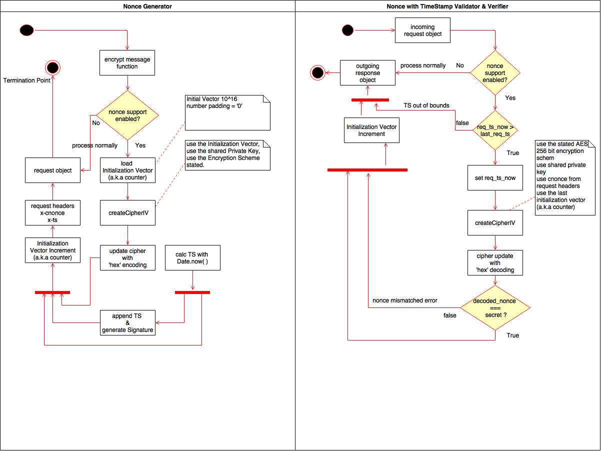

Title: Cryptographic Nonce in Authenticated Systems
Date: 2016-10-2 10:12
Slug: nonce-auth-systems
Summary: Nonce - Number only once. A security measure implemented on stateless service based signed APIs to prevent attacker from resending old request subsequently.

What is Nonce ?
-------------
Cryptographic Nonce is a random or arbitrary number which is used only once. The number involves timestamping and to avoid number predicting in future requests, the number generated should be such that it should be probabilistically impossible to get the same number repeated again. It is used as a means in security mechanisms to ensure that previous request cannot be used in subsequent requests. This concept is used to avoid attacks where in a network the data exchanged between two servers is repeated and delayed by a malicious user intercepting the API calls between NodeJS and PHP server. That’s why they are called as playback attacks or replay attacks.

Why use it ?
--------------
 - If implemented, Nonce will avoid the playback or replay attacks from happening especially if the APIs are served with no SSL encryption over HTTP. 
 - Now, this may happen if originator or a fraudster retransmits the entire signed APIs as part of DOS(Denial of Service) attack. The way to avoid replay/playback attacks is to employ token based sessions. 
 - The technique is commonly used in finance firms.These are one-time tokens. The one-time token is delivered to the recipient when the recipient request one from the server. The recipient performs math transformation on its end with the data and sends the result and also the data to the server. If it matches then the call is proved to be authentic.
 - Nonce is one of the technique in practice to prevent replay attacks which is like ‘request -> serve request -> forget request’ assuming a suitable time frame.

*Note: Keywo-\* isolated services of application*

Nonce in Practice between Keywo-NodeJS, Keywo-PHP and Keywo-Notifier:
---------------------------------------------------------------

Nonce implementations vary based on the architecture of the systems. Here is how I implemented Nonce at
work.

- To apply nonce in our systems, we have to keep machines in sync. 
- The time sync can be maintained using NTP on each machine. NodeJS should be given the priority of providing precision timestamp to PHP server and the notifier.
- It’s an interesting puzzle and is certainly plausible. Without time synchronization between servers, we will not see the benefactors of Nonce. 

Nonce generator and verifier pseudocode:
---------------------------------------
Our endpoints send nonce along with a digital signature & a public key. 
With Nonce support enabled in the settings of each service, the Digital Signature will change with every request even if the request parameters are same for the API. This is because, the authentic server has to include request headers - nonce and timestamp at which the nonce was created. The Digital Signature  will have the timestamp appended to the tail of the text before the digest is calculated from the text. This will cause human orchestrated API calls painfully difficult to crack because the person has to know the secret used to generate the subsequent nonce. Only trusted machines know the secret to nonce generation at that particular
time.

