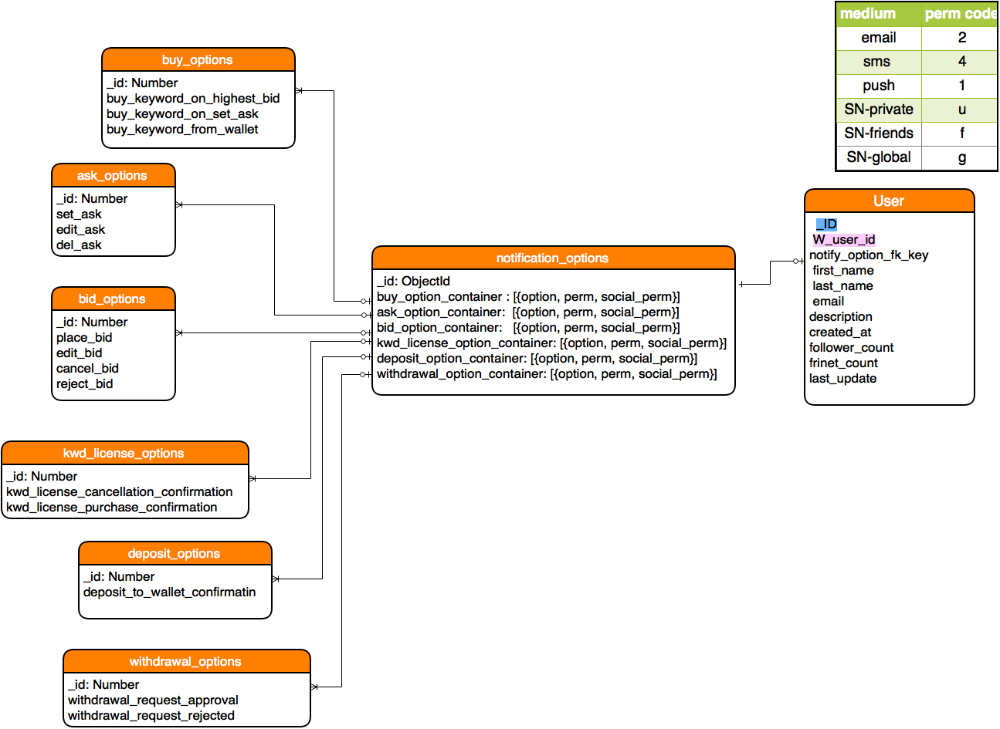
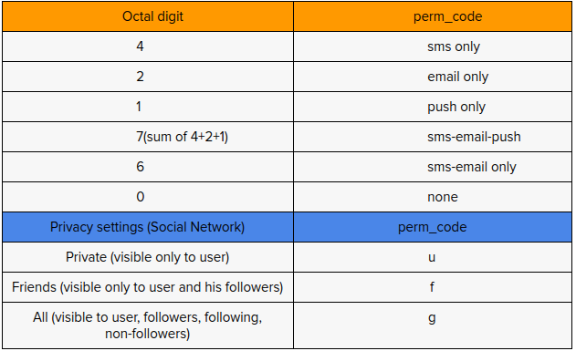

Title: Common User Settings as a Reusable app
Date: 2015-01-12 14:27
Slug: user-settings-app
Summary: Started off as one of the module for a project, later got matured into a standalone package which can be reused in a whole new app with fewer modifications.

Reusable Apps in a traditional 3-tier application architectures have proved to be very useful in 
delivering out of box functionality.

The above schematic diagram shows internal structure of setting user preferences options for Searchtrade wallet users both existing and new. The revised wallet code presets both existing and new users with default notification preferences when they signup or login.As of wallet v2.1.0, there are about 16 notification option possibilities(shown above in the figure) arising from every keyword search, provided that the user is registered on searchtrade.com. The complexity of managing the notification user preferences is done by grouping them into  containers. 

Workings:
---------
Following are the containers used when running the user preference API. These containers acts as fields and must be send in request body. They are typically sent when making a service call from another machine like php appln server.

* buy_container
* ask_container
* bid_container
* deposit_container
* withdrawal_container
* kwd_license_container

Using containers to group notification options helps us to classify options into categories.They provide immense flexibility both from API user’s and maintainers standpoint by allowing them to update only the affected container and rest of them stay untouched. This allows faster request-response calls and avoids unnecessary execution of other containers which is not changed by user.In other words user preference APIs allows the caller to make granular change to the user settings.

With every container it is required to send the perm_code until which the options in the container are not recorded and simply not valid.The term “perm_code” refers to the type of medium user wishes to get  notified about the activity happening on the wallet.The validation is achieved by imposing strict constraints on containers-perm_code pairs  by applying regex on the ids inside the container.The perm codes apply to each option in the container.

Now as per request from upstream management, the user preferences module is designed to handle privacy settings of searchtrade’s keyword bidding network along with wallet preferences, who’s code is under development at the time of writing this doc.
So, the user preferences API takes in either option as a single character from (user-friends-group ) which evaluates as either u, f, g and concats it with an integer from (sms-email-push) by adding -summing up its associated values.

Example 1 
----------
Buy_container -> [1, 2, 3] then its valid perm_code can be “u7u6u1”

Therefore, evaluating the above example, buy_container has three option ids who’s perm_code when decoded is index 0 of buy_container which is id -> 1 has privacy setting set to user(private) and notify preference set to sms-email-push. Next, going to index 1 of buy_container which is id -> 2 has privacy setting set to user(private) but this time has notify preference set to sms-email only and lastly, going to last index of buy_container which id id-> 3 has privacy setting user(private) and notify preference set to push only.

Example 2
---------
Buy_container -> [1,3] then its valid perm_code can be “u0u3”

This example shows if  a user does not wish  to be notified for notification id -> 1 who’s perm_code “u0” when decoded is privacy setting set to user(private) and notify preference set to none - which means the person simply does not want  to receive notification via sms-email-push for that option id.
